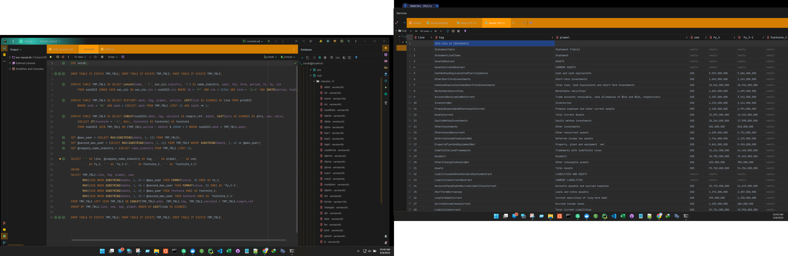

pst...want to dive right in without the hassle of retrieving the data? if you follow this link here &#9758; [sql_files](https://1drv.ms/f/s!Aqm-BwLD86xdgebfPunR3faRAV6tXhg?e=vhDIi1), you'll find a consolidated version of this dataset for public use &#128077;&#128077;&#128077; (see bottom of page for an example)     

# SEC_Financial_Statement_Data_Sets_To_Docker_MySQL
notes: 
 - username/password placed in .py file for simplicity
 - because of the size of the data, RAM usage will be 20+GB on Docker VM
 - modify batch size and sleep time as required, based on your HW allowances
 - if you still get an error regarding tag "doc" column being too long, try 'BLOB' rather than varchar
 - due to the many insert errors, the FSDS column definitions (https://www.sec.gov/files/aqfs.pdf) are not used here
   - this is less likely due to the parsing method used and more likely caused by the 'incompleteness' of data during earlier years
   - values are, for the most part, defined as varchar's, which will be updated either by:
     (a) separately after insert, or
     (b) original code modification  
     [this will be completed once a better idea of where the majority of the issue lies, and/or a better understanding of the dataset is achieved]

# DOWNLOAD REQUIRED APPLICATIONS IF NEEDED
DOCKER: https://www.docker.com/products/docker-desktop/  
PYTHON3: https://www.python.org/downloads/  

# CREATE AND RUN MYSQL DOCKER
docker run --name sec-mysql-db -e "MYSQL_ROOT_PASSWORD=Mypass123456" -p 3306:3306 -d mysql:latest  
[create virtual environment and install requirements]  

# DOWNLOAD A COPY OF fsds.py
[fsds.py](https://github.com/TranDenyDFW/SEC_Financial_Statement_Data_Sets_To_Docker_MySQL/blob/main/fsds.py)  

# RUN APP [make desired changes, mentioned in notes above, prior to running app]
py fsds.py  

# EXPLORE DATA
[num tables will be fairly large - approximating 2M to 3M rows each quarter, starting in late 2011]  
  

# NUM
  

# PRE
  

# SUB
  

# TAG
  

# DO SOMETHING WITH DATA
...  
EXAMPLE SQL FILE: [ex1.sql](https://github.com/TranDenyDFW/SEC_Financial_Statement_Data_Sets_To_Docker_MySQL/blob/main/ex1.sql)
  

